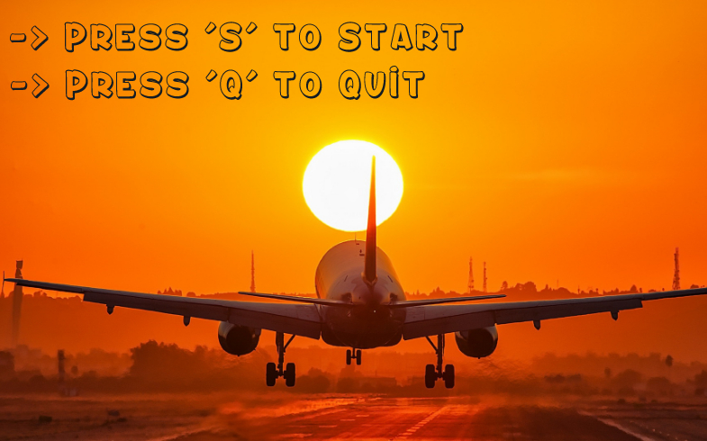

# ✈️ My-Radar - Air Traffic Simulation

## Description

Welcome to My Radar! 🚀 

This project is an air traffic simulation where planes travel between control towers, avoiding collisions with the help of an optimized collision detection system and spatial partitioning.

## Key Features:

Real-time Air Traffic Simulation ✈️ – Planes navigate between towers dynamically.

Collision Detection ⚠️ – Uses an AABB (Axis-Aligned Bounding Box) algorithm.

Optimized Performance 🚀 – Implements quadtree spatial partitioning to reduce calculations.

Customizable Scripts 📜 – Define plane paths, speeds, and delays.

Enhanced Features in this Version 🏆:

        Start menu

        Quadtree visualization

        Day & night cycle

        Simulation pause functionality

## Screenshot



## Usage

To run the simulation, you need a script file defining:

Tower positions

Plane departure points, speeds, and delays

Example script files can be found in assets/scripts/. You can also generate your own using ./```script_generator.py```.

## Installation & Setup

Clone the repository and compile the project:

```
 git clone https://github.com/gabrielgonta/my-radar.git
 cd my-radar
 make
```

## Running the Simulation

Start the simulation with :

```
./my-radar
```

To see -help :

```
./my-radar -h
```

## Authors

* **Gabriel Gonta** - *Initial work* - [My-Radar](https://github.com/gabrielgonta/my-radar.git)